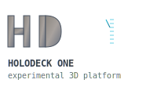

<div align="center">
  
</div>

# HD1 (Holodeck One) 🧪

**Experimental 3D interface platform - Turn services into 3D with HTTP calls**

⚠️ **EXPERIMENTAL SOFTWARE** - This is research/prototype code, not production ready!

## The Holodeck Dream

HD1 is named after Star Trek's holodeck - the ultimate interactive 3D environment where any reality could be simulated and experienced. The vision is equally ambitious: **what if any software service could render as an immersive 3D interface?** Instead of flat web pages and mobile apps, imagine email floating as 3D objects in space, calendar events as physical blocks you can walk around, or AI assistants as interactive avatars you can meet in virtual rooms.

The dream is simple: **HTTP calls that create 3D worlds**. Just like REST APIs revolutionized how we build web services, HD1 explores whether 3D interfaces could be as easy as making HTTP requests. No WebGL expertise, no 3D engine complexity - just send JSON and get immersive experiences.

## The Technical Journey

HD1's development reveals the brutal complexity of 3D web development. Our git history tells a story of constant framework switching as we searched for the right abstraction:

**🌐 Early WebGL Era**: Started with raw WebGL and vanilla JavaScript - the performance was there, but the development complexity was crushing. Every 3D operation required dozens of lines of matrix math and shader management.

**🎮 A-Frame VR Phase** (2024): Pivoted to A-Frame for its declarative HTML approach to VR. The entity-component-system was elegant, and VR support was built-in. But A-Frame's abstractions hid too much - we couldn't achieve the surgical precision needed for an API-driven platform.

**⚡ Three.js Migration** (2025): Finally settled on Three.js r170 as the sweet spot between power and usability. Direct access to scene graphs, materials, and geometries, but without the low-level pain of raw WebGL. The extensive API surface made it perfect for HTTP endpoint mapping.

**Current Reality**: HD1 is an **experimental WebGL REST platform** exploring HTTP-to-3D concepts with Three.js. We're nowhere near the holodeck dream, but we're learning what's possible when you treat 3D graphics like REST APIs.

```bash
# Create a 3D sphere
curl -X POST http://localhost:8080/api/geometries/sphere \
  -H "Content-Type: application/json" \
  -d '{"radius": 2, "color": "#ff0000", "position": {"x": 0, "y": 1, "z": 0}}'

# Add some lighting  
curl -X POST http://localhost:8080/api/lights/directional \
  -d '{"color": "#ffffff", "intensity": 1, "position": {"x": 10, "y": 10, "z": 5}}'
```

## 🎯 What HD1 Does

**What We're Exploring:**
- 🧪 **HTTP → 3D Concept** - Can REST API calls create 3D objects?
- 🧪 **Basic Three.js Endpoints** - Some geometry, material, lighting endpoints working
- 🧪 **WebSocket Sync** - Experimental real-time updates
- ⚠️ **NOT Production Ready** - Rough prototype, expect bugs and missing features!

**Potential Applications (Future Goals):**
- 📧 **Email Apps** → Maybe floating 3D mail objects in space?
- 📅 **Calendar Apps** → Possibly spatial time blocks and 3D scheduling  
- 🤖 **AI Services** → Could be interactive 3D avatars
- 📊 **Analytics** → Might do 3D data visualization
- 🎮 **Any Service** → The dream: 3D interfaces without WebGL complexity

## 🚀 Quick Start

```bash
# 1. Start HD1
cd src && make && make start

# 2. Open the console
open http://localhost:8080

# 3. Create your first 3D scene via API
curl -X POST http://localhost:8080/api/geometries/box \
  -H "Content-Type: application/json" \
  -d '{"width": 2, "height": 2, "depth": 2, "color": "#00ff00"}'

# 4. View it live at http://localhost:8080
```

## 🎨 What Currently Works (Maybe)

### **Some Three.js Endpoints (Work in Progress)**
- **Geometries**: Box, sphere, cylinder - basic shapes mostly work
- **Materials**: Basic, phong - simple materials implemented  
- **Lighting**: Directional, point - basic lighting exists
- **Cameras**: Perspective camera control somewhat functional
- **Animations**: Experimental keyframe support
- **Textures**: Basic texture loading attempts

### **Experimental Features**
- **WebSocket Sync**: Attempts real-time updates (sometimes works)
- **Multi-User Support**: Basic session management
- **Avatar System**: Simple avatar tracking with cleanup
- **Mobile Controls**: Touch controls exist but need work

### **Basic Infrastructure**
- **Auto-Generated Code**: JavaScript client generated from schema
- **Configuration**: Environment variables, flags, .env files
- **Logging**: Basic structured logging  
- **Monitoring**: Simple API status endpoints

## 🏗️ Architecture

```
HTTP API → Sync Operations → WebSocket Events → Three.js Rendering
```

**Single Source of Truth**: Everything driven by `src/schemas/hd1-api.yaml`

- **Backend**: Go server with auto-generated routes
- **Frontend**: Pure Three.js r170 with zero abstraction layers  
- **Sync**: TCP-simple reliability with sequence numbers
- **Config**: Zero hardcoded values, fully configurable

## 📊 API Examples

### Create 3D Objects
```bash
# Spinning torus with PBR material
curl -X POST http://localhost:8080/api/geometries/torus \
  -d '{"radius": 3, "tube": 1, "radialSegments": 16}'

curl -X POST http://localhost:8080/api/materials/physical \
  -d '{"color": "#8844ff", "metalness": 0.8, "roughness": 0.2}'
```

### Scene Management  
```bash
# Set background color
curl -X PUT http://localhost:8080/api/scene \
  -d '{"background": "#87CEEB"}'

# Add fog for atmosphere
curl -X PUT http://localhost:8080/api/scene \
  -d '{"fog": {"color": "#ffffff", "near": 1, "far": 100}}'
```

### Camera Control
```bash
# Position the camera
curl -X POST http://localhost:8080/api/cameras/perspective \
  -d '{"fov": 75, "position": {"x": 10, "y": 5, "z": 10}, "lookAt": {"x": 0, "y": 0, "z": 0}}'
```

## 🎮 Controls

- **Desktop**: WASD movement, mouse look, ESC to exit pointer lock
- **Mobile**: Left side for movement, right side for camera look
- **Touch**: Fully optimized for mobile devices

## 📁 Project Structure

```
/opt/hd1/
├── src/                      # Go backend source
│   ├── schemas/hd1-api.yaml  # Single source of truth API spec
│   ├── api/*/handlers.go     # Generated HTTP handlers  
│   ├── router/auto_router.go # Generated routing
│   └── config/config.go      # Configuration management
├── share/htdocs/static/      # Frontend assets
│   ├── js/hd1lib.js         # Generated API client (69 methods)
│   ├── js/hd1-threejs.js    # Three.js scene manager
│   └── vendor/threejs/      # Three.js r170 library
└── build/                   # Build artifacts
    ├── bin/hd1             # Compiled server
    └── logs/               # Application logs
```

## 🔧 Configuration

HD1 uses a priority-based config system: **Flags > Environment Variables > .env File > Defaults**

```bash
# Environment variables (HD1_ prefix)
export HD1_HOST=0.0.0.0
export HD1_PORT=8080
export HD1_LOG_LEVEL=INFO

# Command line flags  
./hd1 --host=127.0.0.1 --port=9090 --log-level=DEBUG

# .env file support
echo "HD1_PORT=3000" > .env
```

## 🛠️ Development

⚠️ **XVC Required**: This project was developed with [XVC (eXtensible Version Control)](https://github.com/osakka/xvc/tree/main). 
Understanding XVC workflows may be necessary for full development.

```bash
# Build and start (basic development)
cd src && make && make start

# Clean rebuild  
make clean && make build

# Stop daemon
make stop

# View logs
make logs

# Check status
make status
```

**Note**: Some development workflows may require XVC commands and understanding of XVC's experimental data versioning approach.

## 📚 API Documentation

- **[Complete API Reference](src/schemas/hd1-api.yaml)** - OpenAPI 3.0.3 specification
- **[Development Context](CLAUDE.md)** - Technical implementation details
- **JavaScript Client**: Auto-generated `hd1lib.js` with all 69 methods

## 🌟 Why HD1?

**Before HD1:**
```javascript
// Complex Three.js setup
const scene = new THREE.Scene();
const camera = new THREE.PerspectiveCamera(75, window.innerWidth / window.innerHeight, 0.1, 1000);
const renderer = new THREE.WebGLRenderer();
const geometry = new THREE.BoxGeometry(1, 1, 1);
const material = new THREE.MeshBasicMaterial({color: 0x00ff00});
const cube = new THREE.Mesh(geometry, material);
scene.add(cube);
// ... 50+ more lines of WebGL setup
```

**With HD1:**
```bash
# One HTTP call
curl -X POST http://localhost:8080/api/geometries/box -d '{"color": "#00ff00"}'
```

**Perfect for:**
- 🚀 **Rapid Prototyping** - 3D interfaces in minutes, not weeks
- 🌐 **Any Backend** - Python, Node.js, Java, PHP - if it can make HTTP calls, it can render 3D
- 📱 **Mobile First** - Touch controls built-in, works on any device
- 👥 **Team Development** - Designers work with HTTP APIs, not WebGL code
- 🔄 **Real-Time Apps** - Built-in WebSocket sync for collaborative experiences

## 📈 Current Status

- **Version**: v1.0.0 (Experimental Prototype)
- **API Endpoints**: ~40 implemented, many incomplete or buggy
- **Platform**: Experimental WebGL REST platform 
- **Architecture**: Work in progress, some hardcoded values cleaned up
- **Mobile**: Basic touch controls, needs improvement
- **Real-Time**: WebSocket sync working for simple operations

## 🚦 Getting Help

1. **API Issues**: Check `make logs` for detailed error information
2. **Configuration**: See environment variables section above  
3. **Development**: Review `CLAUDE.md` for technical context
4. **Performance**: Built-in metrics at `/api/sync/stats`

## 🔗 Related Projects

This project uses **[XVC (eXtensible Version Control)](https://xvc.dev)** for data and model versioning.

## ⚠️ Important Disclaimers

- **Experimental Code**: This is research/prototype quality, not production software
- **XVC Development**: This project was developed using [XVC (eXtensible Version Control)](https://github.com/osakka/xvc/tree/main) for experimental data/model versioning
- **Expect Bugs**: Many features are incomplete or broken
- **No Guarantees**: APIs may change, data may be lost, things may not work
- **Use at Own Risk**: This is exploratory development, not a finished product
- **Development Dependencies**: Full development requires XVC understanding and setup

---

**HD1 v1.0.0**: Experimental platform exploring HTTP-to-3D concepts. Very much a work in progress! 🧪